<!--
  Profile README for github.com/Jay007mach/Jay007mach.
  boot-log.svg and scoreboard-card.svg are self-hosted animated SVGs (SMIL),
  so nothing here depends on a third-party badge service being up.
-->

<table>
<tr>
<td valign="top"></td>
<td valign="top"></td>
</tr>
</table>

## Jay Machhi

**B.Tech Information Technology · GCET (CVM University) · GATE Aspirant**

 

<!-- animated activity pitch, refreshed daily by .github/workflows/update-profile.yml -->

---

## 💫 About Me

I'm an Information Technology undergraduate with a strong focus on **cracking the GATE exam**, driven by deep conceptual understanding and rigorous problem-solving practice. I'm actively strengthening my core CS foundations while staying adaptable across applied technologies and interdisciplinary domains.

A background in sports shows up in how I work — **discipline, consistency, teamwork, and resilience** carry over into every project and every problem set. I like taking complex ideas apart, rebuilding them simply, and improving through hands-on iteration, discussion, and collaboration.

I'm open to any technical, analytical, or logical problem that compounds into long-term growth.

---

## 🚀 Featured Projects

<table>
  <tr>
    <td width="50%">
      <h3 align="center">Image Caption Generator</h3>
      

        Deep-learning system that generates natural-language captions for images —
        CNN-based visual feature extraction feeding into a sequence model for
        text generation.
          
        <b>Tech Stack:</b> Python, TensorFlow, Keras, CNN, LSTM, NumPy
      

      

        
      

    </td>
    <td width="50%">
      <h3 align="center">Gamified Expense Manager</h3>
      

        Personal expense manager that turns saving into a game — built on the
        Spring Framework with an MVC architecture and reward-driven UX to
        nudge better financial habits.
          
        <b>Tech Stack:</b> Java, Spring Framework, Advanced Java, MySQL, MVC
      

      

        
      

    </td>
  </tr>
  <tr>
    <td width="50%">
      <h3 align="center">YATRIKA — Travel Companion Platform</h3>
      

        AI-powered Gujarat tourism companion: budget prediction, demand
        forecasting, safety scoring, companion matching, and TSP-optimized
        route planning, all backed by a 197k-row research-grounded dataset.
          
        <b>Tech Stack:</b> React, Node.js, Express, MongoDB, scikit-learn, SBERT, NetworkX
      

      

        
      

    </td>
    <td width="50%">
      <h3 align="center">TrafficVision — Vehicle Detection & Tracking</h3>
      

        Real-time traffic analytics from video: vehicle detection, speed
        estimation, tracking, and downloadable heatmap reports through a
        live Flask dashboard.
          
        <b>Tech Stack:</b> Python, Flask, OpenCV, YOLOv8, ByteTrack, Chart.js
      

      

        
      

    </td>
  </tr>
</table>

---

## 💻 Tech Stack

### 🧠 Programming Languages

### 🌐 Web & Application Development

### 🗄️ Databases & Backend

### 🤖 Data Science & Machine Learning

### 🛠️ Tools & Utilities

---

### 🔝 Top Contributed Repositories

---

